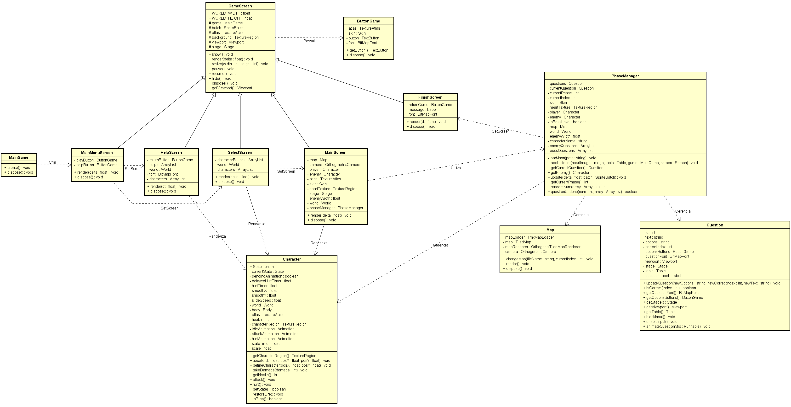

# Busque Conhecimento

## 1. Identificação

Nome: Júlio Augusto de Barros Mansan <br>
Curso: Sistemas de Informação.


## 2. Objetivo

Criar uma experiência gamificada baseada em perguntas de múltipla escolha relacionadas a diferentes áreas do conhecimento. Nesta experiência, o usuário deve escolher um personagem dentre quatro disponíveis. Cada personagem possui perguntas de alguma área específica, com base em suas características. O jogador deve passar por 3 mapas, derrotando inimigos comuns com perguntas fáceis e chegando a um inimigo mais forte, onde terá de responder corretamente a 3 perguntas de nível difícil. 

O usuário tem 3 vidas. Caso responda 1 questão incorretamente em qualquer parte do mapa, ele perde 1 vida. Caso perca as 3, o jogo reinicia. A cada troca de mapa, a vida regenera.

## 3. Desenvolvimento

### MainMenuScreen

Para iniciar o projeto, pensei em um objetivo extremamente simples: criar uma imagem que preenchese toda a janela do aplicativo. Parecia uma tarefa superficial no começo, porém foi essencial para a compreensão de alguns conceitos essenciais para a criação de jogos e afins, como a utilização do ``SpriteBatch``, ``TextureAtlas`` e ``Viewport``. Este último se mostrou um tanto complexo, mas passível de entendimento após um tempo.

Percebi que o jogo teria uma quantidade significativa de telas e que todas possuíriam alguns atributos e métodos em comum, por isso, criei uma classe-mãe chamada ``GameScreen``, responsável por renderizar as telas e ajustar o ``Viewport``.

Consegui colocar uma imagem placeholder que preenchia toda a tela, independente de seu tamanho. Concluído esse objetivo, a próxima tarefa era criar um botão para trocar entre telas. Nesse contexto, tomei conhecimento de dois aspectos imprescendíveis: ``Stage`` e ``Table``. Este facilita o posicionamento de determinados layouts na tela, e aquele gerencia os inputs do usuário. 

Percebi que o jogo demandaria certa quantia de botões, então criei uma classe ``ButtonGame``, que recebe um texto como parâmetro e cria um objeto ``TextButton`` com isso. Devido à semelhança de estilo que os botões possuem, o construtor da classe se utiliza de um design padrão fornecido em um ``TextureAtlas`` dentro da pasta assets.

### SelectScreen

Finalizada, por ora, a tela de Menu Principal, progredi para a criação da tela de seleção de personagens. Optei por manter a mesma imagem da tela anterior, apenas como placeholder. O próximo passo era criar quatro botões representando os personagens disponíveis para a escolha do jogador.

Não se mostrou uma tarefa árdua, pois a utilização de ``Table`` auxiliou bastante no processo. Pude assim, organizar os quatro inputs na parte inferior da tela.

### MainScreen

A próxima etapa do projeto era toda a lógica do jogo em si. Criei então uma ``MainScreen``, que demandava quatro tarefas em paralelo:

- Renderizar um mapa;
- Criar o jogador;
- Criar o inimigo;
- Buscar uma questão e mostrá-la na tela.

Para renderizar o mapa, foi necessário gerar um ``TiledMap`` e adequar o ``Viewport``, a fim de que se encaixasse perfeitamente na janela. Acabei enfrentando alguns problemas quanto a isso. Por vezes, o mapa ficava descentralizado ou nem carregava, mas depois de alguns ajustes, pude carregá-lo sem maiores problemas. A propósito, utilizei o software Tiled para criar os mapas.

Quanto à criação do jogador e do inimigo, cogitei criar duas classes diferentes para ambos. Porém, como eles compartilham os mesmos atributos e métodos, gerei uma classe ``Character``, apenas passando para seu construtor os parâmetros necessários.

A parte das questões gerou algumas dúvidas. De início, pensei em consumir dados de uma API (https://opentdb.com/api_config.php), porém os dados se encontravam na língua inglesa e pretendia manter o jogo traduzido. Então, fiz algumas chamadas, traduzindo as questões e adaptando para um estilo diferente em alguns arquivos ``.json`` ao longo do programa. Para melhor controle, criei uma classe ``Question``, que se utilizava de uma Label para enunciado, e quatro ButtonGames para as respostas. 

Com isso concluído, o esqueleto do projeto estava pronto. Entretanto, duas coisas me incomodavam: a grande quantidade de linhas que ``MainScreen`` possuía e o fato dos personagens estarem estáticos. 

Para resolver o primeiro problema, criei uma classe ``PhaseManager``, que seria responsável pela lógica principal do jogo: tratar respostas das questões, controlar animações dos personagens, controlar o fluxo do jogo, etc. A propósito, criei uma classe ``Map`` para controlar o fluxo de troca entre eles e excluir algumas linhas de PhaseManager.

O segundo problema demandou certo esforço. Foi necessário compreender um pouco da classe ``Animation`` da libGdx e controlar as animações a partir de uma mecânica de estado em que o personagem se encontra. Depois de alguns ajustes, as animações de "Idle", "Attack" e "Hurt" estavam funcionando.

### Ajustes

Com a lógica de jogo pronta, comecei a buscar os sprites necessários para inimigos e para os personagens jogáveis. Além de criar todos os 12 mapas necessários. Foi uma tarefa que exigiu bastante tempo, por incrível que pareça. Muitos dos sprites possuíam tamanhos distintos, o que exigiu um pequeno ajuste de escala na classe Character. No fim, optei por deixar inimigos comuns com uma escala menor e "chefões" com escala maior. Entretanto, alguns ainda ocupam espaço em demasia na tela. 

Depois disso, gerei todas as questões necessárias com chamadas frequentes da API e as adaptei para o padrão já estabelecido dentro dos arquivos ``.json``.

Alterei ainda os backgrounds das telas iniciais, substituindo o placeholder e adicionei os quatro personagens na tela de seleção, para que o usuário pudesse ver com quem iria jogar.

Além disso, para deixar as transições mais suaves, apliquei um fade-in/fade-out nas questões passando um parâmetro ``Runnable``. Também apliquei um leve slide para que a entrada dos personagens não fosse tão abrupta. Ademais, apliquei um leve delay para encaixar a animação de ataque com a animação de levar dano, tanto para o inimigo, quanto para o jogador. Por fim, bloqueei o input enquanto alguma animação estiver sendo executada.

### FinishScreen

Uma vez que os ajustes estavam prontos, decidi criar uma tela sinalizando que o jogo encerrou, levando em consideração se o jogador pôde derrotar todos os chefes, ou perdeu todas as vidas no processo. Foi algo bem simples: criei uma classe ``FinishScreen``, classe filha de ``GameScreen`` e seu construtor recebe como parâmetro "Você Venceu!" ou "Você Perdeu!". Assim, a Label escreve tal mensagem na tela e é criado um ``GameButton`` que retorna ao menu principal.

### HelpScreen

Foi um processo realmente simples, o que me garantiu tempo para criar uma tela de ajuda, que explica o funcionamento geral do jogo. Criei quatro ``Labels`` com o mesmo background que as ``Labels`` da classe ``Question`` possuem. Criei um ``ButtonGame`` que retorna ao menu e adicionei os quatro personagens na parte inferior da tela, porém apenas com fins estéticos. 

## 4. Diagrama de Classes



## 5. Instrução de execução

Para executar localmente 

- Certifique-se de possuir:

1. Java JDK 8 ou superior;
2. Gradle;

- Clone o repositório: 
````
git clone https://github.com/elc117/gamification-2025b-julio.git
````

- Windows:
````
gradlew.bat lwjgl3:run
````
- Linux/MacOS:
````
gradlew lwjgl3:run
````

Para acessar online (recomendado): https://julio-mansan2.itch.io/busque-conhecimento

## 6. Demonstração do Programa


## 7. Referências


